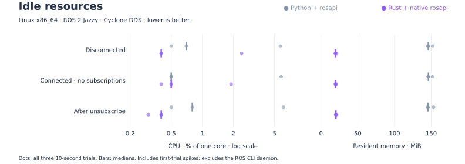
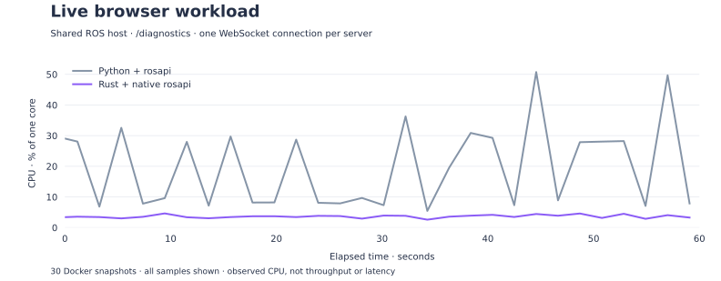

# rosbridge_server_rs

[](https://github.com/yumeminami/rosbridge_server_rs/actions/workflows/ci.yml)
[](LICENSE)
[](docs/usage.md)

**A fast, lightweight ROS 2 WebSocket server, written in Rust.**

Use the Python rosbridge protocol to publish and subscribe to topics, call services,
and exchange Action goals. The server connects through native RCL/RMW and loads
message definitions at runtime, including custom interfaces. No generated Rust
message bindings or Python server process are required.

<picture>
  <source media="(prefers-color-scheme: dark)" srcset="benchmarks/results/comparison-dark.svg">
  <source media="(prefers-color-scheme: light)" srcset="benchmarks/results/comparison.svg">
  
</picture>

Measured JSON topic roundtrips on Linux ARM64 / ROS 2 Jazzy, with 32 messages in flight. Rust release build versus **Python rosbridge 2.7.0**; three 2-second trials per configuration. These localhost measurements do not establish production capacity.

[Method and reproduction](benchmarks/README.md) · [Latency, CPU, memory and raw results](benchmarks/results/README.md)

<picture>
  <source media="(prefers-color-scheme: dark)" srcset="benchmarks/results/idle/comparison-dark.svg">
  
</picture>

Same-host idle comparison, including rosapi: median CPU after unsubscribe was
**0.40% for Rust and 0.80% for Python**; with a connection but no subscriptions,
both were approximately **0.50%**. Three 10-second trials per state, with all
first-trial spikes retained. This measures idle operation, not camera throughput.
[Raw data, caveats and reproduction](benchmarks/results/idle/README.md).

<picture>
  <source media="(prefers-color-scheme: dark)" srcset="benchmarks/results/live/comparison-dark.svg">
  
</picture>

With two simultaneous browser sessions subscribing to `/diagnostics`, Rust used
**82% less average container CPU** in this observation. Both servers ran on the
same Linux x86_64 host with ROS 2 Jazzy. Thirty Docker snapshots were collected
at approximately two-second intervals, without restarting either server.

| Resource metric | Rust + native rosapi | Python + rosapi |
| --- | ---: | ---: |
| Mean container CPU | **3.64%** | 19.80% |
| Median container CPU | **3.57%** | 14.61% |
| Peak sampled container CPU | **4.63%** | 50.74% |
| Mean service process RSS | **29.5 MiB** | 168.0 MiB |

CPU is expressed as a percentage of one core. RSS measures the Rust server process
and the sum of the Python WebSocket and rosapi processes, excluding launch and
diagnostic processes. RSS comes from a separate, earlier 30-sample observation;
summed RSS can count shared pages more than once. This is a live workload
observation, not a controlled throughput, latency or frame-loss benchmark.
[Raw samples and measurement limits](benchmarks/results/live/README.md).

## Install and run

Requires **Ubuntu 24.04 and ROS 2 Jazzy**. Download the `.deb` matching your
architecture from [v0.1.0](https://github.com/yumeminami/rosbridge_server_rs/releases/tag/v0.1.0):
`amd64` for Intel/AMD, or `arm64` for ARM64. With the ROS apt repository configured:

```bash
sudo apt install ./rosbridge-server-rs_0.1.0_ubuntu24.04_amd64.deb
source /opt/ros/jazzy/setup.bash
rosbridge_server_rs
```

Use the `arm64` filename on ARM64. Connect your client to `ws://localhost:9090`
(or the server's IP address). All 29 rosapi services are built in.
Source your ROS workspace before starting the server if you use custom messages.

Archive installation and checksum verification: [installation guide](docs/install.md).
Options: [usage](docs/usage.md). Developers: [build from source](docs/building.md).

## Protocol support

| Area | Supported behavior |
| --- | --- |
| Topics | Publish, subscribe, advertise, QoS, throttling and shared subscriptions |
| Services | Calls and advertisements in both directions, request IDs and timeouts |
| Actions | Goals, feedback, results and cancellation in both directions |
| Messages | Nested fields, arrays, bounded sequences, defaults and Base64 bytes |
| Encoding | JSON, CBOR, CBOR-RAW, PNG and JSON fragmentation |

**All 13 upstream WebSocket cases pass on both Rust and Python.** Additional tests
cover message conversion, resource ownership and error handling. See the
[compatibility results](benchmarks/README.md#compatibility-results).

This is an early implementation and does not support all Python server
configuration. Use absolute ROS names. Native macOS builds,
other ROS distributions and production stability remain unverified.
[Protocol boundaries](docs/usage.md#limitations) are documented explicitly.

## Development

Protocol tests run without ROS:

```bash
cargo test --locked --no-default-features
cargo fmt --check
```

For native tests, place `rosbridge_suite` beside this repository or set
`ROSBRIDGE_SUITE_PATH` to its location, then run:

```bash
docker compose run --build --rm test
```

The container builds upstream test interfaces and runs native conversion,
protocol and WebSocket integration tests. See [benchmarks](benchmarks/README.md)
for the separate compatibility and performance runners.

```text
src/
  main.rs          Command-line entry point
  server.rs        WebSocket connections and ROS worker
  bridge/          Protocol state, topics, services and actions
  backend.rs       ROS backend contract and QoS
  ros/             Native handles and runtime message conversion
  wire.rs          Encoding and fragmentation
tests/             Protocol and ROS/WebSocket integration tests
scripts/           Test environment preparation and execution
benchmarks/        Reproducible measurements and plots
```

Use `cargo fmt` for Rust and `black --line-length 100` for Python. Keep native ROS
handles on the worker thread; WebSocket tasks communicate through bounded queues.

CI checks formatting, Clippy, protocol tests and upstream WebSocket compatibility
on native Linux x86_64 and ARM64 runners. It also installs and tests each package
in a clean ROS 2 Jazzy runtime container. Version tags publish tested `.deb` and
`.tar.gz` packages with SHA-256 checksums to GitHub Releases.

See [CHANGELOG](CHANGELOG.md) for release history.

## License

EPL-2.0 OR Apache-2.0. See [LICENSE](LICENSE), including third-party notices.
