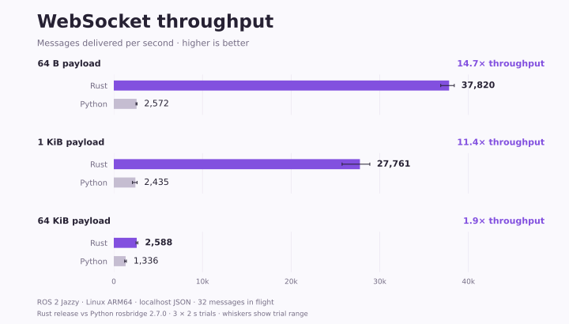

# rosbridge_server_rs

**A fast, lightweight ROS 2 WebSocket server, written in Rust.**

Use the Python rosbridge protocol to publish and subscribe to topics, call services,
and exchange Action goals. The server connects through native RCL/RMW and loads
message definitions at runtime, including custom interfaces. No generated Rust
message bindings or Python server process are required.

<picture>
  <source media="(prefers-color-scheme: dark)" srcset="benchmarks/results/comparison-dark.svg">
  <source media="(prefers-color-scheme: light)" srcset="benchmarks/results/comparison.svg">
  
</picture>

Measured JSON topic roundtrips on Linux ARM64 / ROS 2 Jazzy, with 32 messages in flight. Rust release build versus **Python rosbridge 2.7.0**; three 2-second trials per configuration. These localhost measurements do not establish production capacity.

[Method and reproduction](benchmarks/README.md) · [Latency, CPU, memory and raw results](benchmarks/results/README.md)

## Build and run

Requires Linux, ROS 2 Jazzy, Rust 1.93 or later, and `clang` / `libclang-dev`.
Install the ROS interface packages used by your application, including their C
typesupport and introspection libraries.

```bash
source /opt/ros/jazzy/setup.bash
# Source your ROS workspace here if you use custom interfaces.
cargo build --locked --release
./target/release/rosbridge_server_rs --bind 127.0.0.1:9090
```

Connect your rosbridge client to `ws://127.0.0.1:9090`.
See [configuration and examples](docs/usage.md) for CLI options and WebSocket usage.

## Protocol support

| Area | Supported behavior |
| --- | --- |
| Topics | Publish, subscribe, advertise, QoS, throttling and shared subscriptions |
| Services | Calls and advertisements in both directions, request IDs and timeouts |
| Actions | Goals, feedback, results and cancellation in both directions |
| Messages | Nested fields, arrays, bounded sequences, defaults and Base64 bytes |
| Encoding | JSON, CBOR, CBOR-RAW, PNG and JSON fragmentation |

**All 13 upstream WebSocket cases pass on both Rust and Python.** Additional tests
cover message conversion, resource ownership and error handling. See the
[compatibility results](benchmarks/README.md#compatibility-results).

This is an early implementation. It does not replace the separate `rosapi` node or
all Python server configuration. Use absolute ROS names. Native macOS builds,
other ROS distributions and production stability remain unverified.
[Protocol boundaries](docs/usage.md#limitations) are documented explicitly.

## Development

Protocol tests run without ROS:

```bash
cargo test --locked --no-default-features
cargo fmt --check
```

For native tests, place `rosbridge_suite` beside this repository or set
`ROSBRIDGE_SUITE_PATH` to its location, then run:

```bash
docker compose run --build --rm test
```

The container builds upstream test interfaces and runs native conversion,
protocol and WebSocket integration tests. See [benchmarks](benchmarks/README.md)
for the separate compatibility and performance runners.

```text
src/
  main.rs          Command-line entry point
  server.rs        WebSocket connections and ROS worker
  bridge/          Protocol state, topics, services and actions
  backend.rs       ROS backend contract and QoS
  ros/             Native handles and runtime message conversion
  wire.rs          Encoding and fragmentation
tests/             Protocol and ROS/WebSocket integration tests
scripts/           Test environment preparation and execution
benchmarks/        Reproducible measurements and plots
```

Use `cargo fmt` for Rust and `black --line-length 100` for Python. Keep native ROS
handles on the worker thread; WebSocket tasks communicate through bounded queues.

## License

EPL-2.0 OR Apache-2.0. See [LICENSE](LICENSE), including third-party notices.
