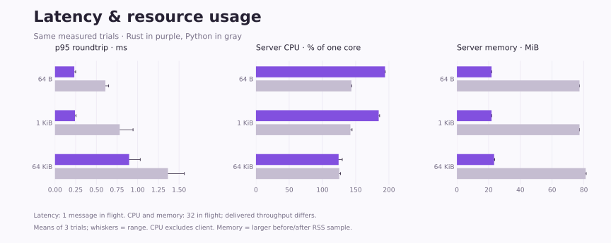

# WebSocket benchmark results

Linux ARM64 / ROS 2 Jazzy, Rust release build versus Python rosbridge 2.7.0. Three trials per configuration; values below are means of trial summaries. See [method](../README.md) and [environment](environment.json).

| Payload | Python p95 RTT, 1 in flight | Rust p95 RTT, 1 in flight | Python msg/s, 32 in flight | Rust msg/s, 32 in flight | Throughput ratio |
| --- | ---: | ---: | ---: | ---: | ---: |
| 64 B | 0.609 ms | 0.234 ms | 2,572 | 37,820 | 14.71× |
| 1,024 B | 0.783 ms | 0.242 ms | 2,435 | 27,761 | 11.40× |
| 65,536 B | 1.366 ms | 0.897 ms | 1,336 | 2,588 | 1.94× |

These are end-to-end localhost measurements, including the benchmark client, ROS transport and Docker scheduling. They do not establish maximum capacity or production performance. Error bars show trial range, not confidence intervals. CPU excludes the client; RSS is sampled before and after each trial.

See [compatibility coverage](../README.md#compatibility-results) and the [per-case upstream results](parity.json) for the current correctness checks. The measurements above predate subsequent protocol-compatibility fixes; the measured binary hash is retained in environment.json.
