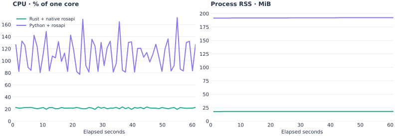

# SoC live subscriptions — 2026-09-06

Rust rosbridge_server_rs 0.1.1 and Python rosbridge with rosapi ran concurrently
on the same eight-core ARM64 SoC with ROS 2 Jazzy. The user confirmed both browser
sessions subscribed to `/diagnostics`, `/head_mount/imu`, and `/head_mount/button`.
The Python connection log confirms these topic names. Traffic reached both servers
through the same host's Caddy proxy. No server was restarted for this measurement.
The installed Python rosbridge version was not captured.

| Metric | Rust + native rosapi | Python + rosapi |
| --- | ---: | ---: |
| Mean CPU | 21.72% | 110.52% |
| Peak interval CPU | 23.53% | 171.57% |
| Mean process RSS | 18.00 MiB | 192.06 MiB |

The 60 intervals span 61.05 seconds: shell sampling overhead extends the requested
60-second window. CPU is the change in `/proc/PID/stat` utime + stime divided by
elapsed `/proc/uptime`, with CLK_TCK=100, expressed as a percentage of one core.
Mean CPU uses total CPU time divided by the full measured duration. RSS comes
from `VmRSS` in `/proc/PID/status`, converted from KiB to MiB and averaged over
interval endpoints. PID start times were checked to exclude process replacement.

Rust PID: 1678912. Python WebSocket PID: 19550; rosapi PID: 19551.
Only the service processes are included, excluding uv, shells, launchers and the
proxy. Python mean CPU splits into 77.82% WebSocket and 32.69% rosapi. Summed RSS
may count shared pages twice. Container memory is not used in this comparison.

This is one live observation, not a controlled capacity benchmark. Message rates,
payload equality, latency and dropped messages were not measured. Reduced resource
use alone does not establish equivalent delivery. These samples predate the new
INFO lifecycle logging; they do not measure its overhead.

- [Raw process snapshots](proc.txt)
- [Per-interval samples](samples.csv)
- [Summary](summary.json)

Recreate the figure with `python3 benchmarks/plot_soc.py` (requires matplotlib).
To repeat sampling, identify current service PIDs with `docker top`, read their
`/proc/PID/stat` and `/proc/PID/status` alongside `/proc/uptime` once per second
for 61 snapshots, and use the actual elapsed intervals in the CPU calculation.
